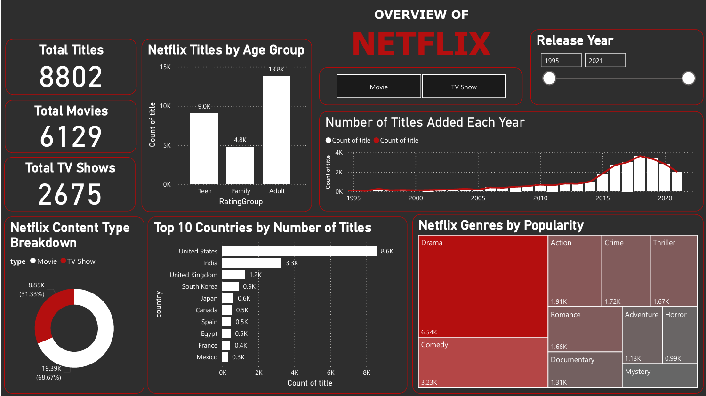
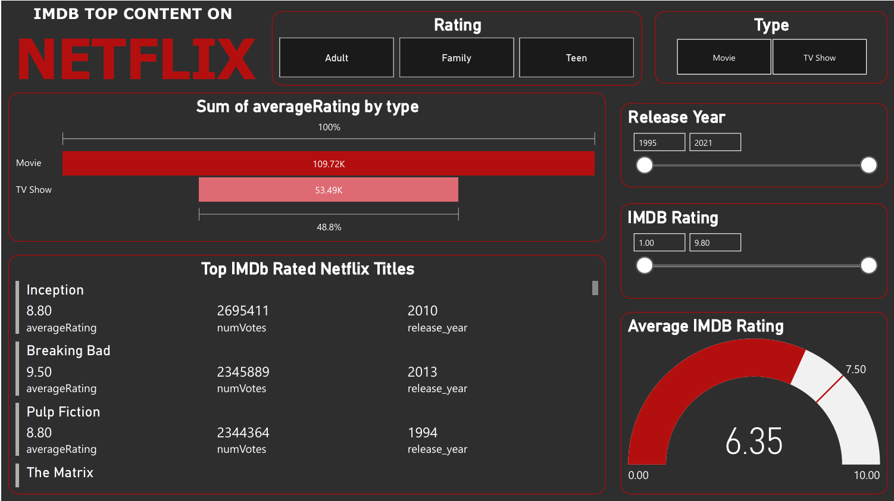

# 🎬 Netflix & IMDb Analytics Dashboard

This project presents an end-to-end analysis of Netflix titles merged with IMDb ratings using Power BI. It explores content trends, genre popularity, and audience ratings through dynamic visualizations built from multiple real-world datasets.

---

## 🎯 Objectives

- Merge and prepare data from Netflix and IMDb using Power Query
- Visualize content growth trends across years and types (Movies/TV Shows)
- Analyze genre frequency and rating distributions
- Build a professional, multi-page Power BI dashboard

---

## 🔍 Project Highlights

- Combined **Netflix and IMDb** datasets for enriched insights  
- Used **Power Query** to merge, clean, and transform data
- Designed a **2-page interactive dashboard** featuring:
  - KPI cards for title counts and average ratings
  - Bar + Line combo chart for release trends
  - Genre-wise treemap with slicers
  - Ratings gauge and vote metrics
  - Page-level slicers for dynamic exploration
    
---

## 🛠️ Tech Stack

| Tool               | Purpose                                |
|--------------------|----------------------------------------|
| Power BI Desktop   | Data modeling, cleaning & dashboarding |
| Power Query Editor | Data transformation & merging          |

---

## 📂 Files Included

| File/Folder                  | Description                                     |
|-----------------------------|-------------------------------------------------|
| `netflix_imdb_merged.csv`   | Cleaned, final dataset used in Power BI         |
| `netflix_imdb_dashboard.pbix` | Power BI report file with 2 pages            |
| `assets/page1.mp4`          | MP4 walkthrough of Page 1 – Netflix Overview    |
| `assets/page1.png`          | Sceenshot of Page 1 – Netflix Overview          |
| `assets/page2.mp4`          | MP4 walkthrough of Page 2 – Ratings Analysis    |
| `assets/page2.png`          | Screenshot of Page 2 – IMDb Ratings Analysis         |
| `README.md`                 | This documentation file                         |

---

## 🎥 Dashboard Preview

### 📄 Page 1 – Netflix Overview 

[▶️ Watch MP4](assets/page1.mp4)

---

### 📄 Page 2 – IMDb Ratings Analysis 

[▶️ Watch MP4](assets/page2.mp4)

---

## 📌 Key Insights

- 🎥 Netflix's content production surged after 2015, especially for TV Shows  
- 🧾 Drama and Documentary dominate the genre landscape  
- ⭐ Highly-rated content often belongs to niche genres with fewer votes  
- 📈 Some genres show stable performance across years, others fluctuate
- 📉 Type-based filtering reveals interesting trends between Movies and TV

---

## 📁 Dataset Source

- [IMDb Datasets](https://datasets.imdbws.com/)
- [Netflix Titles (Kaggle)](https://www.kaggle.com/datasets/shivamb/netflix-shows)

> ✅ Only the cleaned, merged dataset is included due to size constraints.

---
